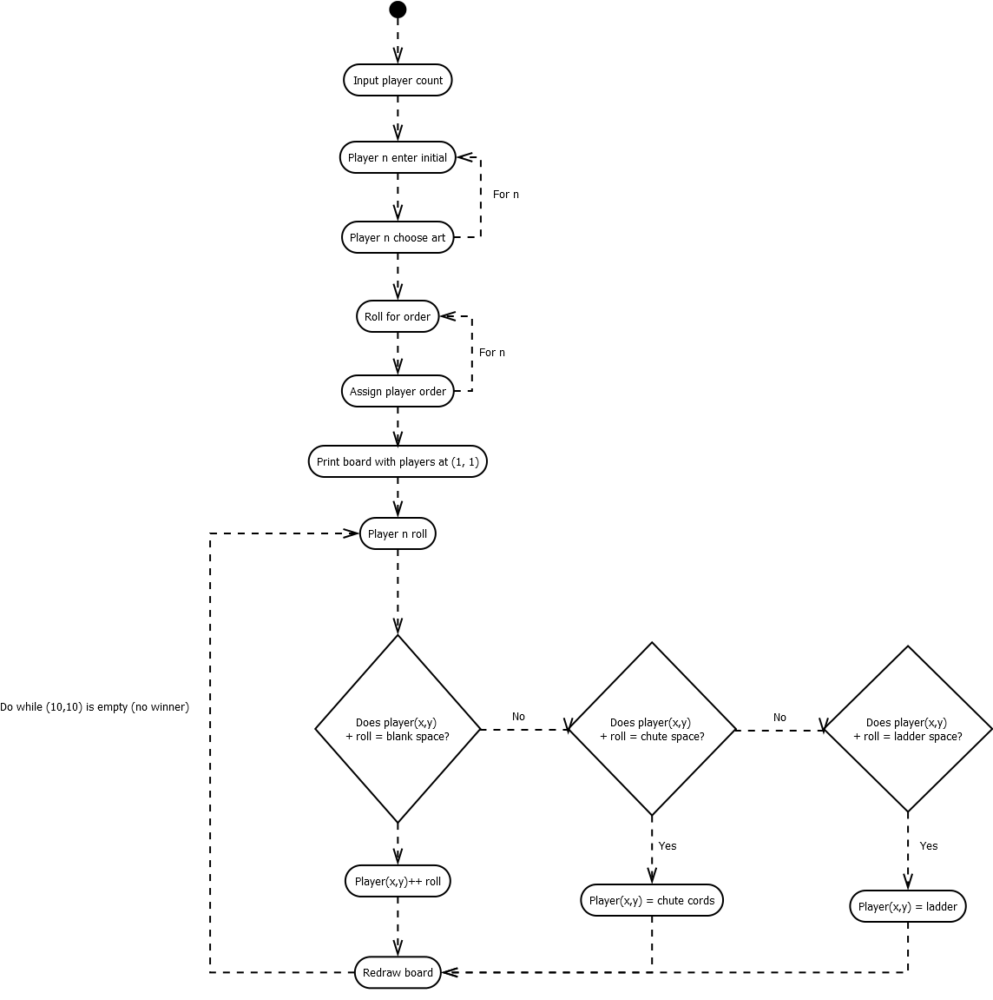
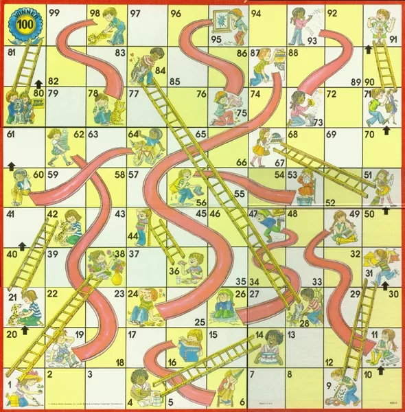

# Chutes and Ladders

# Work Detail
## Preface
I encourage everyone to read both the documentation for the assignment, and the documentation I've written here and in my classes to make sure you have a full grasp of the project. I am arbitrarily assigning tasks. If you are not happy with your assignment, you're welcome to partner up or switch with someone else; as long as it gets done and everyone has written _something_. 

You are welcome to change anything I have written so far, but what I have provided should be considered the working copy. 

- **Christina** & **Ryan**: Finish the `Token` class. The logic for moving pieces within the bounds of the board should _probably_ be handled by the `Token` class, but discuss this with the game logic team. You may find a better solution, or another class entirely to handle character movement. If the team decides to implement ascii art for each player, it is your responsibility to manage that data.
- **Joshua**: Create the `die` class. Consider including some animation for rolling, like ascii art moving on the screen. Remember, dice rolls will be used when deciding turn order and movement.
- **David** & **Donnie**: You are responsible for the game logic, aka. the main class file. I have provided multiple breakdowns of how the game works. You should also work on the game menu, where the number of players and their data are input. 

I would encourage all of you to meet regularly to discuss how the data will flow between your classes and methods. The project isn't complicated but it is absolutely an exercise in breaking a problem down to its smallest parts. 

I will be available for code reviews every day. I will do my best to give direction, rather than rewrite something you have already written. Understanding the logic is the most important part, not _just_ getting it done.

---


# How to Run
To compile and run `Dice.java`:
`cd src/main`
`javac -cp .:../lib/core.jar Dice.java`
`java -cp .:../lib/core.jar Dice`


# Game Components

- 10x10 Grid numbered from 1-100 from bottom left to top left
- 4 game piece tokens
- 1 die, 2 for faster games


# Game Flow
- Each player starts on square 1.
- Player 1 rolls a die to determine the number of spaces to move. 
	- If a player rolls a 6, they roll again _after_ moving.
- If a player lands at the foot of a ladder, they move to the top of the ladder. 
- If a player lands at the top of a chute, they move to the foot of the chute.
- Repeat for each player




# Win Condition
The first player to reach the last square wins.

## Variations
- A player must roll the exact amount of spaces to reach the last square, or they lose their turn.
- A player must roll the exact amount of spaces to reach the last square. If they roll a larger number, they move to the end square and back again. For example, if a player requires a _3_ to win, but rolls a _5_, they move _3_ spaces to the win square, and backwards _2_.


# Objects
- PlayerToken
- Die
- Board
- (?)Board exploded

## Die
I think it would be cool to have a short "animation" play while a die is "rolled", but that may not be feasible. Regardless, we need an object that will handle picking an `int` between `1` and `6`. Please refer to Game Flow for further details.

---
## Board

Main view is a viewable 10x10 grid with colored letters to represent each player token. Some command will allow viewing a specific tile that will contain the graphics for each token of each player on that square. 

|Chutes|Ladders|
|-|-|
|16:6|4:14|
|47:26|9:31|
|49:11|28:84|
|56:53|36:44|
|62:19|51:67|
|64:60|71:91|
|93:73|80:100|
|95:75|-|
|98:78|-|



```java
private int playerCount;
  private int dimension;
  private Token p1;
  private Token p2;
  private Token p3;
  private Token p4;

public Board(int dimension, int playerCount, Token p1, Token p2, Token p3, Token p4){[...]}
```

```
*************************************************************
*     *     *     *     *     *     *     *     *     *     *
*     *     *     *     *     *     *     *     *     *     *
*************************************************************
*     *     *     *     *     *     *     *     *     *     *
*     *     *     *     *     *     *     *     *     *     *
*************************************************************
*     *     *     *     *     *     *     *     *     *     *
*     *     *     *     *     *     *     *     *     *     *
*************************************************************
*     *     *     *     *     *     *     *     *     *     *
*     *     *     *     *     *     *     *     *     *     *
*************************************************************
*     *     *     *     *     *     *     *     *     *     *
*     *     *     *     *     *     *     *     *     *     *
*************************************************************
*     *     *     *     *     *     *     *     *     *     *
*     *     *     *     *     *     *     *     *     *     *
*************************************************************
*     *     *     *     *     *     *     *     *     *     *
*     *     *     *     *     *     *     *     *     *     *
*************************************************************
*     *     *     *     *     *     *     *     *     *     *
*     *     *     *     *     *     *     *     *     *     *
*************************************************************
*     *     *     *     *     *     *     *     *     *     *
*     *     *     *     *     *     *     *     *     *     *
*************************************************************
* a b *     *     *     *     *     *     *     *     *     *
* c d *     *     *     *     *     *     *     *     *     *
*************************************************************
```

- Range of player1: `j(2:56), increment by 6; i(2:29), increment by 5`
- Range of player2: `j(4:58), increment by 6; i(2:29), increment by 5`
- Range of player3: `j(2:56), increment by 6; i(3:30), increment by 5`
- Range of player4: `j(4:58), increment by 6; i(3:30), increment by 5`

Base additional coordinate movements off the base position of player1, (2, 2). `Token` will take care of offsets, after which the correct value will be passed to `Board` when called by a method. 


---
## PlayerToken
```java
public class Token{
  private int playerX;
  private int playerY;
  private char initial;
  private String model;

  public Token(char initialInput, String modelInput, int playerX, int playerY){[...]}
```

---
## Game Menu
The game menu should provide a way to enter the number of players, their initials, and their ascii art if used. 


---
## Main Class
Game flow here


---
# Variations
_See: Win Condition#Variations_
- Provide an animation of the piece moving by drawing an update as the piece passes each square.
- If a player lands on an occupied square, the original occupants are moved back _n_ spaces (maybe 2?).
- A command can be given to show a blown up view of a square with the ascii art in place of the players' initials.
- Make sure the `Board` can accurately draw different board dimensions. I have some of the logic in there, but I have not checked it, as the assignment only calls for a size of 10x10.
- Draw the chutes and ladders either on the existing board or on a duplicate board off to the side. Duplicate board would not contain the player pieces and only have a static visual of the chutes and ladders.
- Provide an animation every time a die is rolled.
